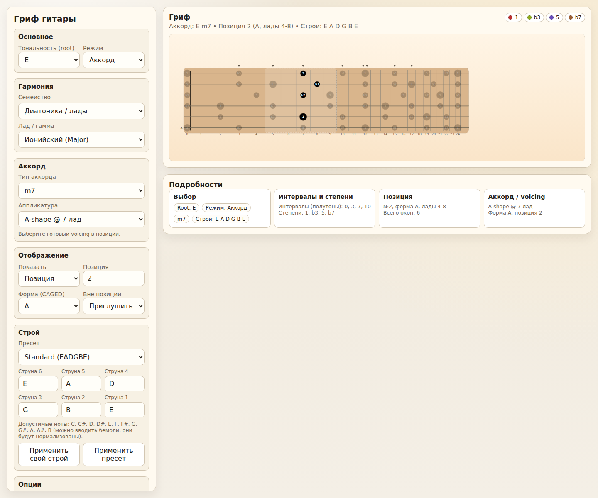

# Guitar Fretboard Explorer

## Онлайн-версия

- GitHub Pages: https://isfea.github.io/guitar-chords/

Веб-страница для визуализации грифа гитары:
- стандартный и альтернативные строи (Open / Drop / custom),
- подсветка гармоний (пентатоника, диатонические лады, блюзовые, базовые джазовые),
- режимы отображения по позициям,
- режим аккордов (готовые аппликатуры/voicings),
- простой audio preview для аккордов и гамм,
- сохранение настроек в `localStorage`.

## Зачем это нужно

Это практический инструмент для гитариста, который помогает быстрее ориентироваться на грифе и понимать, что именно играть в выбранной тональности. Вместо того чтобы каждый раз пересчитывать ноты, интервалы и позиции в голове, можно сразу увидеть нужную картину на грифе и быстро проверить идею.

Чем помогает на практике:
- быстро найти ноты аккорда или гаммы в любой тональности;
- увидеть позиции и CAGED-формы на грифе без ручного поиска;
- разбирать аккорды, интервалы и ступени при занятиях и разучивании материала;
- проверять, как меняется аппликатура и набор нот в альтернативных строях (`Drop`, `Open`, `custom`);
- использовать как наглядную шпаргалку на репетиции или во время домашней практики;
- услышать ориентировочное звучание выбранного аккорда или гаммы через встроенный audio preview.

Инструмент полезен начинающим (чтобы связать теорию с грифом), продолжающим гитаристам (позиции, транспонирование, CAGED), а также преподавателям и ученикам для наглядного разбора материала.

## Демо



## Быстрый старт

1. Запустить локальный сервер:
   ```bash
   ./run.sh
   ```
2. Открыть адрес из вывода (например `http://127.0.0.1:48561`).
3. Остановить сервер:
   ```bash
   ./stop.sh
   ```

## Документация

- Локальный запуск и деплой: `DEPLOY_LOCAL.md`
- Инструкция по использованию: `USAGE.md`
- Тестирование: `TESTING.md`
- Техничка по Playwright: `TESTING_PLAYWRIGHT.md`
